# Architecture

> This is an implementation guide. [`SPEC.md`](../SPEC.md) is authoritative for
> protocol behavior and compatibility requirements.

`eez-proof-signer` is a stateless, single-flight attestation service. A Composer
streams one complete block window. The daemon re-executes every block, binds a
supported settlement batch to the resulting evidence, recomputes the public
input, and signs it. Any failed stage returns no signature.

```mermaid
flowchart LR
    C[Composer] -->|ProveChunk stream| RPC[service/rpc]
    RPC --> ING[service/stream]
    ING --> ADM[window admission]
    ADM -->|AdmittedWindow| JOB[blocking validate_and_settle]

    CFG[Operator configuration] --> SVC[ProveSvc: limits and active request slot]
    CFG --> STATE[ServiceState: validator and configured identities]
    SVC --> RPC
    STATE --> JOB

    JOB --> ST[Stateless and Reth]
    ST -->|BackendWindowOutput| VAL[shared output checks]
    VAL -->|ValidatedWindow| SET[settlement binding and authorization]
    SET --> HASH[RecomputedPublicInputsHash]
    HASH --> AUTH[AttestablePublicInputsHash]

    STATE --> ATT[Attester]
    AUTH --> MATERIAL[AttestationMaterial]
    MATERIAL --> ATT
    ATT -->|hash and signature| C
```

## Responsibility boundaries

| Module | Owns |
| --- | --- |
| [`main.rs`](../src/main.rs) | Startup wiring, tracing, server lifetime, graceful shutdown |
| [`config.rs`](../src/config.rs) | CLI/environment parsing, secret redaction, startup validation |
| [`service.rs`](../src/service.rs) | Shared immutable dependencies, limits, and the one active-request slot |
| [`service/stream.rs`](../src/service/stream.rs) | Stream draining and transport-timeout normalization |
| [`service/rpc.rs`](../src/service/rpc.rs) | Async orchestration, absolute deadline, worker lifetime, signing, response |
| [`service/settlement_job.rs`](../src/service/settlement_job.rs) | The synchronous validation-to-settlement handoff and error provenance |
| [`window.rs`](../src/window.rs) | Incremental structural admission and aggregate resource accounting |
| [`validate.rs`](../src/validate.rs) | Associated backend-output contract, shared cross-checks, `ValidatedWindow` normalization |
| [`validate/stateless.rs`](../src/validate/stateless.rs) | Chain-aware decode/recovery, checkpoint planning, Stateless execution |
| [`settlement/`](../src/settlement.rs) | Focused batch, block, state, inbound, outbound, and DA gates |
| [`attest.rs`](../src/attest.rs) | Attestation identity and typed attestable-hash signing |
| [`cancel.rs`](../src/cancel.rs) | Cooperative cancellation shared with synchronous work |

This is a binary crate, so `main.rs` is the crate root and the implementation
has no public library API. Rust allows a parent module such as `service.rs` to
declare children in `service/rpc.rs`, and a child such as
`validate/stateless.rs` can in turn declare `validate/stateless/chain_config.rs`.
That file-plus-directory layout is intentional: the parent file exposes the
module boundary while the directory holds focused implementation pieces. It
does not change runtime behavior or import semantics because every module is
declared explicitly.

The split follows trust boundaries, not just file size. `window` may reject
malformed structure but cannot claim a block is valid. `validate` may prove
execution but does not interpret a settlement entry. `settlement` may join
already validated facts but cannot manufacture missing execution evidence.

## Data narrows as it moves

1. `WindowAssembler` produces an `AdmittedWindow`. Its `AdmittedBlock` values
   retain Composer-declared metadata, exact RLP, and execution witnesses after
   stream-shape, identity, adjacency, and quota checks.
2. The Stateless adapter consumes those witnesses and returns one
   `BackendWindowOutput`. Each `BackendBlockOutput` keeps its computed identity,
   post-state root, receipt outcomes, selected checkpoints, and settlement
   evidence together.
3. Shared validation consumes both representations, binds every backend output
   to its admitted block, and normalizes the checked result into
   `ValidatedWindow`.
4. `ValidatedWindow` drops the consumed witnesses. It retains exact block RLP,
   `window_pre_state_root`, `settling_pre_state_root`,
   `window_post_state_root`, `preceding_blocks`, and the terminal
   `settling_block` with its settlement evidence.
5. Independently, the submitted `PostBatch` calldata becomes a
   `CanonicalPostBatch`. Canonical decoding does not validate its state or
   effect claims. Settlement binds those claims into a `BoundEffectSequence`,
   then produces `AuthorizedInboundEffects` and `AuthorizedOutboundEffects`.
6. After every settlement gate passes, the checked public-input profile
   produces a locally computed `RecomputedPublicInputsHash`. The complete job
   then promotes it to `AttestablePublicInputsHash`, whose private construction
   records the stronger all-gates-passed guarantee. `AttestationMaterial`
   carries that capability to the attester, which accepts neither a
   profile-only recomputation nor Composer-provided hash bytes.

This ownership reduction is intentional: once a witness has been consumed and
its result checked, later layers should not continue carrying an alternative
untrusted representation of the same fact.

## Trust boundaries

| Source | Treatment |
| --- | --- |
| Composer stream | Entirely untrusted, including hashes, RLP, witness, range, calldata, and claimed public-input hash |
| Operator configuration | Deployment authority for the chain document, expected rollup ID, configured proof-system vkey, proof-system address, keys, and limits |
| `BackendWindowOutput` | Security-critical backend result, consumed and contract-checked against the admitted input before settlement |
| `eez_evm`, Stateless, Reth | Canonical/security-critical implementation base pinned by the workspace |
| Live L1 and L2 fork choice | Not observed by this process |

The RPC transport has no peer authentication of its own. Network controls must
ensure that only intended Composers can reach a non-loopback listener.

## What the signature does not claim

The signature says that this supplied transition and batch passed the active
profile from the validated parent state root. It does not establish canonical
L2 ancestry, sequencer authorization, current L1 applicability, successful
future L1 execution, immediate-versus-deferred dispatch, or independent code
identity at the pinned EEZL2 address. The exact normative boundary is in
`SPEC.md`, especially the state-root authority and attestation sections.

Continue with [Request lifecycle](request-lifecycle.md),
[Validation evidence](validation-evidence.md), or the
[Settlement pipeline](settlement-pipeline.md).
