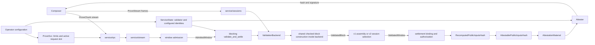

# Architecture

> This is an implementation guide. [`SPEC.md`](../SPEC.md) is authoritative for
> protocol behavior and compatibility requirements.

`eez-proof-signer` serves complete v1 windows and resumable v2 sessions. A
configured backend validates blocks and owns reusable execution evidence. The
service selects a validated window, binds the submitted settlement batch to
it, recomputes the public input, and signs it. Any failed stage returns no
signature.

```mermaid
flowchart LR
    C[Composer] -->|ProveChunk stream| RPC[service/rpc]
    RPC --> ING[service/stream]
    ING --> ADM[window admission]
    ADM -->|AdmittedWindow| JOB[blocking validate_and_settle]

    CFG[Operator configuration] --> SVC[ProveSvc: limits and active request slot]
    CFG --> STATE[ServiceState: validator and configured identities]
    SVC --> RPC
    STATE --> JOB

    JOB --> ST[ValidationBackend]
    ST --> CHECK[shared checked-block construction inside backend]
    CHECK -->|ValidatedBlock| VAL[v1 assembly or v2 session selection]
    C -->|ProveStream frames| SESSION[service/sessions]
    SESSION --> ST
    VAL -->|ValidatedWindow| SET[settlement binding and authorization]
    SET --> HASH[RecomputedPublicInputsHash]
    HASH --> AUTH[AttestablePublicInputsHash]

    STATE --> ATT[Attester]
    AUTH --> MATERIAL[AttestationMaterial]
    MATERIAL --> ATT
    ATT -->|hash and signature| C
```

## Responsibility boundaries

| Module | Owns |
| --- | --- |
| [`lib.rs`](../src/lib.rs) | Backend-neutral server construction and graceful draining |
| [`service.rs`](../src/service.rs) | Shared immutable dependencies, limits, and the v1 active-request slot |
| [`service/stream.rs`](../src/service/stream.rs) | Stream draining and transport-timeout normalization |
| [`service/rpc.rs`](../src/service/rpc.rs) | Async orchestration, absolute deadline, worker lifetime, signing, response |
| [`service/sessions.rs`](../src/service/sessions.rs) | V2 session binding, quotas, prefix ownership, range selection, and epoch/cancellation fencing |
| [`service/settlement_job.rs`](../src/service/settlement_job.rs) | The synchronous validation-to-settlement handoff and error provenance |
| [`window.rs`](../src/window.rs) | Streamed structural admission and aggregate resource accounting |
| [`validate.rs`](../src/validate.rs) | Checked-block evidence contract and shared evidence-shape checks; v1 window assembly |
| [`validate/support.rs`](../src/validate/support.rs) | Identity-bound decoding/recovery, checkpoint planning, and checked-block construction |
| [`eez-prover-stateless`](../../eez-prover-stateless/src/backend.rs) | Witness-backed execution, checked-block cache, scheduling and execution deadlines |
| [`eez-prover-stateful`](../../eez-prover-stateful/src/backend.rs) | Reth-backed execution/cache, checked supplemental checkpoints, current safe ancestry and forkchoice |
| [`settlement/`](../src/settlement.rs) | Focused batch, block, state, inbound, outbound, and DA gates |
| [`attest.rs`](../src/attest.rs) | Attestation identity and typed attestable-hash signing |
| [`cancel.rs`](../src/cancel.rs) | Cooperative cancellation shared with synchronous work |

This is a library crate. `eez-prover-stateless` owns the standalone binary and
CLI, while `eez-prover-stateful` supplies a backend to the copy of this service
hosted by `eez-follower`.

The split follows trust boundaries, not just file size. `window` may reject
malformed structure but cannot claim a block is valid. `validate` may prove
execution but does not interpret a settlement entry. `settlement` may join
already validated facts but cannot manufacture missing execution evidence.

## Data narrows as it moves

1. `WindowAssembler` produces an `AdmittedWindow`. Its `AdmittedBlock` values
   retain Composer-declared metadata, exact RLP, and execution witnesses after
   stream-shape, identity, adjacency, and quota checks.
2. Inside each backend, `DecodedBlock` binds exact RLP to the submitted identity
   and recovers signers. It retains that decoded input while execution produces
   `BackendBlockOutput`. Number, parent and transaction count come from the
   decoded block, not duplicate output fields.
3. `DecodedBlock::finish` checks the execution hash and evidence coverage,
   ordering and bounds before producing an immutable `Arc<ValidatedBlock>`.
   Backend caches publish only checked evidence; no session-local cache or
   scheduler is interposed. New cache-hit submissions must still match the
   stored bytes and exact parent.
4. V1 assembles the admitted sequence returned by replay. V2 appends backend-
   checked extensions only if the captured session epoch and parent are still
   current. Its range selector checks each new Finalize range/terminal claim
   and produces `ValidatedWindow`. The window shares the same blocks and
   decoded bodies; it does not recheck continuity or clone block evidence.
5. Independently, the submitted `PostBatch` calldata becomes a
   `CanonicalPostBatch`. Canonical decoding does not validate its state or
   effect claims. Settlement binds those claims into a `BoundEffectSequence`,
   then produces `AuthorizedInboundEffects` and `AuthorizedOutboundEffects`.
6. After every settlement gate passes, the checked public-input profile
   produces a locally computed `RecomputedPublicInputsHash`. The complete job
   then promotes it to `AttestablePublicInputsHash`, whose private construction
   records the stronger all-gates-passed guarantee. `AttestationMaterial`
   carries that capability to the attester, which accepts neither a
   profile-only recomputation nor Composer-provided hash bytes.

This ownership reduction is intentional: once a witness has been consumed and
its result checked, later layers should not continue carrying an alternative
untrusted representation of the same fact.

## Trust boundaries

| Source | Treatment |
| --- | --- |
| Composer stream | Entirely untrusted, including hashes, RLP, witness, range, calldata, and claimed public-input hash |
| Operator configuration | Deployment authority for the chain document, expected rollup ID, configured proof-system vkey, proof-system and attester addresses, keys, and limits |
| Backend execution results | Security-critical engine output checked inside the adapter before publication as `ValidatedBlock` |
| `eez_protocol`, Stateless, Reth | Canonical/security-critical implementation base pinned by the workspace |
| Live L1 and L2 fork choice | Stateful backend observes Reth retention/safe ancestry and selects the requested terminal; stateless has no live-chain freshness gate |

The RPC transport has no peer authentication of its own. Network controls must
ensure that only intended Composers can reach a non-loopback listener.

## Verification ownership and review map

| Fact | Establish once at | Consumers rely on |
| --- | --- | --- |
| Exact RLP, number, parent and hash identity | Decode/recovery inside each backend | Checked-block construction and settlement use the retained decoded block |
| Execution pre/post-state and consensus validity | Backend execution against its supplied parent | Session append and settlement do not replay blocks |
| Receipt/sender coverage; observation and checkpoint bounds/order | Checked-block construction, before cache publication | Settlement inspection no longer rechecks vector lengths |
| Checkpoints honor the requested plan | Backend checkpoint execution | Settlement still binds positions/candidates to its effect interpretation and new batch claims |
| V2 prefix continuity and selected range | Backend extension plus session append/selection | Window packaging and stateful finalization do not rescan immutable linkage |
| Batch commitments, effects, DA and public inputs | Settlement | Only `AttestablePublicInputsHash` reaches the signer |

Checks with new inputs or observation times remain: cache-hit request binding,
session epoch/parent after execution, requested range/terminal, current Reth
retention and safe ancestry, post-forkchoice state, and epoch/cancellation
before signing. The stateful finalization operation releases its reconciliation
lock on return; its success describes that snapshot, not a lock through signing.

## What the signature does not claim

The signature says that this supplied transition and batch passed the active
profile from the validated parent block. It does not establish canonical
L2 ancestry, sequencer authorization, current L1 applicability, successful
future L1 execution, immediate-versus-deferred dispatch, or independent code
identity at the pinned EEZL2 address. The exact normative boundary is in
`SPEC.md`, especially the authority and attestation sections.

Continue with [Request lifecycle](request-lifecycle.md),
[Validation evidence](validation-evidence.md), or the
[Settlement pipeline](settlement-pipeline.md).
