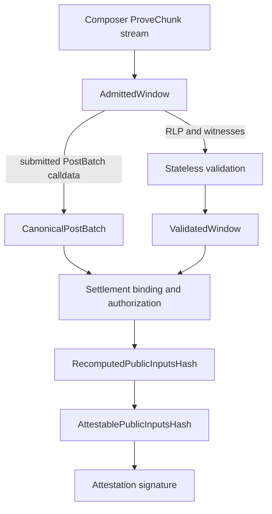

# Data provenance

> This is an implementation guide. [`SPEC.md`](../SPEC.md) is authoritative for
> protocol behavior and compatibility requirements.

The service handles several representations of the same transition. A value's
name should say who supplied it or which local gate established it. Decoding by
itself never turns a Composer claim into validated evidence.

## Naming vocabulary

| Vocabulary | Meaning |
| --- | --- |
| `expected_*`, `configured_*` | Selected by the operator at startup |
| `wire_*` | Protobuf representation before conversion into a domain type |
| `claimed_*`, `submitted_*`, `declared_*` | Controlled by the Composer |
| `decoded_*` | Parsed locally, but not yet semantically validated |
| `recovered_*` | Obtained through fork-aware signer recovery |
| `computed_*`, `observed_*` | Calculated or extracted locally, but not necessarily bound to a composer claim |
| `validated_*` | Accepted by the consensus/execution validation boundary |
| `bound_*` | A composer claim matched to validated execution evidence |
| `authorized_*` | A cross-chain effect accepted by every applicable settlement gate |
| `recomputed_*` | A commitment calculated locally from checked inputs |

Aggregate types carry most of this information. Fields inside a strongly named
type do not repeat its entire state: for example, `AdmittedBlock.rlp` is still
Composer-controlled, while `ValidatedBlock.rlp` is the same exact byte string
retained only after successful replay.

Avoid the unqualified word `trusted` when a more precise source exists. Prefer
`expected_rollup_id`, `configured_chain_spec`, or
`validated_window_pre_state_root` over `trusted_id`, `trusted_config`, or
`trusted_root`.

## Boundary guarantees

### `AdmittedWindow`

The stream header appeared first, the declared inclusive range is valid, all
declared blocks arrived in order, fixed-width hash claims were decoded, claimed
adjacency holds, the header rollup claim matched `expected_rollup_id`, and the
configured resource quotas were respected.

Block hashes, RLP, witnesses, settlement calldata, and the discarded wire
public-input hash remain Composer-controlled. Admission does not establish
consensus or execution correctness.

### Backend results

Stateless exact-decodes the block, recovers signers under the configured fork
rules, checks consensus, verifies the witness pre-state, re-executes the block,
and compares the locally computed post-state root with the header commitment.
The backend returns each block's computed identity, validated roots, receipt
outcomes, selected transaction checkpoints, and settlement evidence together.

Shared validation consumes that backend result and compares it with the
admitted stream. A backend result is not handed to settlement until this
contract check succeeds.

### `ValidatedWindow`

This is the settlement-facing output of execution validation. It contains exact
admitted block bytes, locally validated endpoint roots, system-sender flags,
and outbound receipt observations. The terminal block additionally retains
receipt outcomes and selected transaction checkpoints. It contains no execution
witnesses; validation consumed them.

Its `window_pre_state_root` is not yet a batch anchor. It becomes an anchor only
when settlement matches the leading submitted state update against it.

### `CanonicalPostBatch`

Canonical decoding proves only that the submitted calldata is a complete,
round-trippable ABI representation. The decoded state updates, effects, DA,
rollup assignments, and public-input fields remain untrusted claims.

### Bound and authorized settlement data

The effect-binding gate joins submitted entries to locally derived transaction
positions and state checkpoints. Inbound and outbound authorization then
checks the direction-specific transaction, receipt, call-hash, value, and
ether-delta evidence. DA verification consumes only those authorized bindings.

### `RecomputedPublicInputsHash`

`CheckedPublicInputProfile` constructs this digest by folding the canonical
batch with the configured proof-system vkey. The type proves local computation from a
profile-checked batch; by itself it does not prove that the state, effects, and
DA passed the complete settlement job.

### `AttestablePublicInputsHash`

The complete settlement job wraps the recomputed digest in this stronger type
only after state-chain validation, effect binding and authorization, and exact
DA verification all succeed. `Attester::sign` accepts only this type rather
than `RecomputedPublicInputsHash` or an arbitrary `B256`, so a profile-only or
Composer-supplied digest cannot cross the signing boundary by accident.

## Comment guidance

Comments at these boundaries should answer three questions:

1. Where did the value come from?
2. What has already been checked?
3. What remains unchecked?

Inside a stage, comments should explain a security consequence or a surprising
implementation constraint. They should not merely restate an expression, cite
historical implementations, or label a value “trusted” without identifying its
authority.
