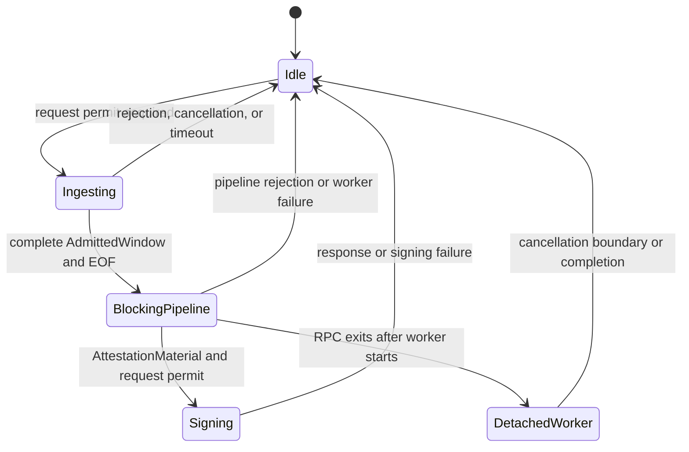

# Request lifecycle

> This is an implementation guide. [`SPEC.md`](../SPEC.md) is authoritative for
> protocol behavior and compatibility requirements.

The service deliberately admits one request at a time. This keeps peak
validation memory and blocking work predictable and makes shutdown semantics
explicit. An overlapping `Prove` RPC is rejected immediately rather than
waiting with an open client stream, even when both RPCs share one connection.



## Happy path

1. [`ProveSvc::prove`](../src/service/rpc.rs) tries to acquire a permit from
   `active_request_slot` without waiting. Failure means another request or
   detached worker owns the only slot.
2. One checked absolute deadline is created for ingestion, validation,
   settlement, and signing.
3. [`read_window`](../src/service/stream.rs) reads the header, records its range
   on the request span, and rejects the Composer-claimed rollup ID when it
   differs from the operator-configured `expected_rollup_id`.
4. `WindowAssembler` validates and accounts every block chunk. The Composer
   must half-close the stream after the complete declared span; only EOF calls
   `finish`.
5. The admitted blocks, submitted `PostBatch` calldata, request permit, and a
   cancellation-token clone move into one `spawn_blocking` task.
6. That task runs validation and settlement together. Returning the request
   permit with `AttestationMaterial` transfers exclusivity back to the async
   request.
7. The async request checks the deadline, signs the contained
   `AttestablePublicInputsHash`, builds `ProveResponse`, and then releases the
   request permit.

## Three independent bounds

| Bound | What it limits |
| --- | --- |
| Per-message decode ceiling | One encoded gRPC message before/while Prost decodes it |
| Aggregate window quotas | Known decoded fields retained and traversed across the request |
| Timeouts | Silence between stream messages and total request wall time |

The aggregate byte quota is based on the canonical encoded size of decoded
known protobuf fields. It is not a replacement for the per-message ceiling,
which also bounds unknown or non-canonical bytes in one protobuf message body.
Block, byte, and witness-item limits cover different cost dimensions and
remain independent.

## Cancellation is cooperative

Dropping the RPC drops its worker guard, which aborts the pipeline task if it is
still queued and flips a shared atomic cancellation flag for a running one.
Aborting a Tokio blocking task prevents it from starting only while it is still
queued; an already-running EVM execution cannot be forcefully aborted safely.

The current worker polls:

- before preparing the settling block and before each backend block
  execution;
- between completed validation and settlement through the absolute deadline;
  and
- before settlement decoding and before the DA gate.

Each individual block execution and settlement gate is synchronous and
non-interruptible. Cancellation latency is therefore bounded by the current
work unit, not by the polling interval of the async runtime.

## Detached work and retries

If the RPC deadline expires after the blocking task starts, the request future
returns but the worker continues until it reaches a cancellation boundary or
completes first. It still owns the request permit, so an immediate retry
receives `Unavailable`. This is transient capacity, not persisted protocol
state: once the worker exits and a retry is admitted, the window is evaluated
from scratch.

## Actionable settlement rejection

Most settlement rejections are deliberately non-actionable: Composer retains
the held transactions and falls back to its normal recovery path. A safely
attributable `FailedPrecondition` instead carries one typed `ProveFailure` in
the status details:

```text
outbound -> terminal Sync-block user tx index + signed tx hash
inbound  -> PostBatch entry index + canonical entry hash
```

Composer accepts the hint only after both references match the exact rejected
request. An outbound reference directly resolves the outbound held
transaction; its preceding synthetic load is regenerated with the Sync block.
An inbound reference resolves through the entry-to-held-transaction mapping
that Composer retained while merging inbound source entries.

The resolved transaction and its same-sender, same-direction nonce suffix are
evicted. Composer then reruns simulation, Sync-block construction, settlement
stitching, witness collection, and proving with the remaining candidates. Each
attempt removes at least one candidate, so same-slot recomposition is bounded;
the normal exact-slot proof cutoff still applies. The unchanged rejected
request is never sent through the transient retry loop.

## Graceful shutdown

On Ctrl-C, and on SIGTERM on Unix, tonic stops accepting connections and drains
request futures without cancelling them. An admitted RPC may therefore run to
completion or its request deadline. The process then waits for
`active_request_slot` to become idle; detached validation is not terminated
halfway through a block or settlement gate.

For operator-facing implications, see [Operations](operations.md).
