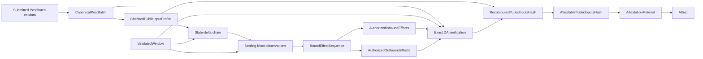

# Settlement pipeline

> This is an implementation guide. [`SPEC.md`](../SPEC.md) is authoritative for
> protocol behavior and compatibility requirements.

Settlement does not “validate the batch” with one broad comparison. It joins
several independently derived views of the same transition. No entry,
checkpoint, event, receipt status, or DA sidecar authorizes an effect by itself.

## Inputs and provenance

| Input | Provenance |
| --- | --- |
| Submitted `PostBatch` calldata | Composer input; `CanonicalPostBatch` proves only complete canonical decoding |
| `ValidatedWindow` | Cross-checked Stateless output plus exact admitted block bytes and locally derived evidence |
| Expected rollup ID, configured proof-system address and proof-system vkey | Independent operator-configured deployment bindings |
| `SystemTransactionReconstructor` | Operator-configured system key combined with chain ID, expected rollup ID, and the fixed EEZL2 address |

## Gate order

[`run_settlement`](../src/service/settlement_job.rs) deliberately stops at the
first failure:

1. `post_batch` exact-decodes and canonical round-trips the full calldata into
   `CanonicalPostBatch`. Its fields remain Composer claims.
2. `CheckedPublicInputProfile` pins the supported one-rollup,
   one-proof-system, timeless shape to the expected/configured deployment
   values. It retains the typed capability needed for later hash computation;
   it never accepts the wire hash as authoritative.
3. `state_chain` requires exactly one expected-rollup delta per entry and a
   continuous chain from `ValidatedWindow.window_pre_state_root` to
   `window_post_state_root`.
4. `blocks` consumes the validated system-sender flags, receipt outcomes, and
   outbound observations in exact transaction order. It rejects
   privileged/effect evidence in `preceding_blocks` and derives the
   `settling_block` effect-candidate framing once.
5. `effect_binding` enforces the leading-anchor and later-effect shapes,
   including the anchor root and zero-value policy, then joins every submitted
   effect, candidate transaction, and locally recomputed checkpoint by ordinal.
   It returns one ordered `BoundEffectSequence`.
6. `inbound` returns `AuthorizedInboundEffects` only after canonical delivery
   transactions match their bound entries, call hashes, outcomes, values, and
   ether deltas.
7. `outbound` returns `AuthorizedOutboundEffects` only after submitted effects
   match validated EEZL2 receipt-event observations and the supported
   success-expected single-call shape, call hash, and value accounting. Exact
   `[load, user]` transaction-byte equality remains the DA gate in step 8.
8. `da` parses the tagged RLP payload without attacker-sized list allocations,
   compares every retained transaction and authorized sidecar, uses
   `SystemTransactionReconstructor` for omitted system transactions, and
   requires byte equality with the validated settling block.
9. Only after every gate passes does `CheckedPublicInputProfile` construct
   `RecomputedPublicInputsHash`. The complete job then wraps it as
   `AttestablePublicInputsHash`; `AttestationMaterial` carries that stronger
   capability and the validated endpoint roots to the async RPC for signing
   and audit logging.

## Why the order matters

The early public-input profile checks cheap structural and operator-configured
identity constraints, but hash computation is delayed until after semantic and
DA gates. `BoundEffectSequence` creates the only entry-to-transaction
correspondence; inbound and outbound gates consume it rather than re-deriving
positions. DA verification receives opaque authorized effect bindings rather
than arbitrary entries, so a caller cannot skip semantic authorization and
still construct a positive-effect payload.

The exact DA comparison closes a separate gap: hashing `callData` commits to
Composer bytes, but does not by itself prove that those bytes describe the
blocks Stateless executed. Reconstruction and raw EIP-2718 equality provide
that binding.

## Active profile

The accepted sequence is one anchor, followed by supported outbound effects,
then supported successful inbound effects. The current outbound subset is one
success-expected call with the required accounting and event evidence. Failed
or lookup-bearing inbound effects, outbound-after-inbound ordering, richer
outbound shapes, and ambiguous evidence reject before signing. Refer to
`SPEC.md` for the exact shapes and equations.

## Module ownership

| Module | Gate family |
| --- | --- |
| [`post_batch.rs`](../src/settlement/post_batch.rs) | `CanonicalPostBatch`, configured public-input profile, typed hash fold |
| [`state_chain.rs`](../src/settlement/state_chain.rs) | State-delta continuity and validated window endpoints |
| [`effect_binding.rs`](../src/settlement/effect_binding.rs) | Entry classification and effect/checkpoint correspondence |
| [`blocks.rs`](../src/settlement/blocks.rs) | Transaction roles, statuses, preceding-block policy |
| [`inbound.rs`](../src/settlement/inbound.rs) | Strict inbound observation and entry authorization |
| [`outbound.rs`](../src/settlement/outbound.rs) | Event-to-entry outbound authorization |
| [`da.rs`](../src/settlement/da.rs) | Borrowed payload parsing and exact transaction/sidecar reconstruction |
| [`system_transactions.rs`](../src/settlement/system_transactions.rs) | System-key validation and `SystemTransactionReconstructor` context |

## Attestation boundary

The final signature commits to the complete supported batch through the
typed `AttestablePublicInputsHash`. `RecomputedPublicInputsHash` proves local
profile-checked computation, while only the complete settlement job can grant
the attestable capability after every gate. The signing API accepts neither the
weaker type nor the Composer-supplied wire hash. The signature proves neither
that L1 will apply the transition nor that an expected outbound call will
succeed in the future. Live-root checks, actual L1 execution, and dispatch
scheduling remain outside this daemon's observation.
