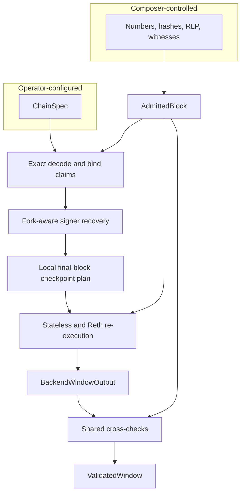

# Validation evidence

> This is an implementation guide. [`SPEC.md`](../SPEC.md) is authoritative for
> protocol behavior and compatibility requirements.

Structural admission and execution validation answer different questions.
Admission proves that a stream has the declared shape and fits configured
quotas. Validation proves that the exact admitted block sequence executes under
the operator-configured chain rules and produces the commitments later used by
settlement.

## Startup initialization

At startup, [`validate/stateless.rs`](../src/validate/stateless.rs) loads the
operator-configured Alloy `ChainConfig` or complete `Genesis` document once,
then builds the Reth `ChainSpec` and EVM configuration shared by every request.

## Per-request adapter stages

For each admitted window, the adapter:

1. Exact-decodes each consensus block RLP and binds its number, parent hash, and
   computed block hash to the Composer claims retained in `AdmittedBlock`.
2. Recovers transaction signers with the fork-aware rules from that same chain
   specification.
3. Derives every settling-block checkpoint position locally from the recovered
   transaction framing. The Composer cannot nominate or suppress positions.
4. Establishes the validated, witness-backed pre-state root, executes the block
   with Stateless/Reth, applies post-execution consensus checks, and recomputes
   the post-state root before matching it to the block-header commitment.
5. Retains receipt statuses, system-sender flags, and outbound event candidates
   from that validated execution. Named but malformed outbound events remain as
   candidates with no decoded hash so later gates fail closed.
6. Requires each returned pre-state root to equal the preceding block's
   computed post-state root, so the window telescopes without relying on a
   Composer root claim.

The Stateless output exposes both the validated pre-state root and the
independently recomputed post-state root. The adapter carries those returned
values into `BackendWindowOutput`; it does not promote a copied Composer or
header claim merely by renaming it.

The checkpoint-enabled path is used only when the final selection is non-empty.
An empty selection uses ordinary Stateless validation and reports an empty
vector; it does not authorize an effect position.

## One associated output per block

| Output | Contents |
| --- | --- |
| `BackendWindowOutput.pre_state_root` | Validated state root from which the first block was replayed |
| `BackendBlockOutput` | Exact-decoded number, parent hash and transaction count; computed hash; recomputed post-state root; exact receipt outcomes; selected transaction-state checkpoints; and settlement evidence for the same block |
| `SettlementBlockEvidence` | Fork-aware system-sender flags and ordered outbound receipt observations derived from that block's accepted execution |

The backend output is not handed directly to settlement.
[`validate.rs`](../src/validate.rs) consumes it alongside the admitted blocks
and checks block count, every decoded identity and computed hash, decoded
transaction count, exact receipt and system-sender
coverage, outbound-observation transaction-index bounds and coordinate order,
checkpoint order and bounds,
and empty checkpoint selections for preceding blocks. A backend rejection is a
window rejection; a backend that claims success with malformed output is an
internal contract failure.

## Why `ValidatedWindow` exists

Parallel vectors make it easy to combine one block with another block's
execution result. `BackendBlockOutput` first keeps associated results together,
and `ValidatedWindow` is the only production handoff after shared checks. It:

- separates `preceding_blocks` from the terminal `settling_block`;
- carries `window_pre_state_root` and `window_post_state_root`;
- derives `settling_pre_state_root` from the preceding output, or from the
  window pre-state root for a one-block window;
- keeps the settling block's receipt outcomes and selected checkpoints beside
  that block; and
- drops witnesses that execution has already consumed.

The window pre-state root is not automatically a batch anchor. Settlement must
still bind the leading submitted state update to it. `ValidatedWindow` is an
architectural boundary, not another proof: construction is safe because the
backend-output contract and admitted input were consumed and checked
immediately beforehand.

## Pinned Stateless extension

This crate depends directly on an exact commit of the
[`eez-association/stateless`](https://github.com/eez-association/stateless)
fork. The fork adds opt-in selected transaction-state checkpoints and returns
the computed pre-state and post-state roots already produced during validation.
Consensus, execution, receipt, gas, and state-root validation remain
Stateless/Reth responsibilities.

A fork change must keep the extension narrow and pass that repository's tests
before this crate updates its pin. The pin update must also pass this crate's
adapter and fixture tests. No alternative validation backend is selectable in
the current binary.

Next, see how these facts are joined in the
[Settlement pipeline](settlement-pipeline.md).
