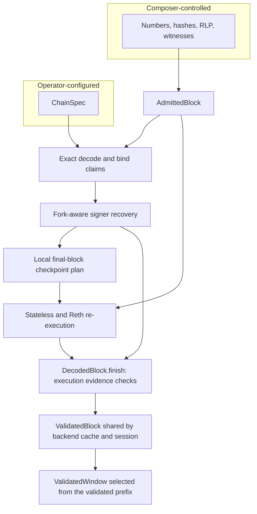

# Validation evidence

> This is an implementation guide. [`SPEC.md`](../SPEC.md) is authoritative for
> protocol behavior and compatibility requirements.

Structural admission and execution validation answer different questions.
Admission proves that a stream has the declared shape and fits configured
quotas. Validation proves that the exact admitted block sequence executes under
the operator-configured chain rules and produces the commitments later used by
settlement.

This guide follows the witness-backed `eez-prover-stateless` implementation.
The node-backed implementation produces the same `BackendWindowOutput` contract
and is described in [`eez-prover-stateful`](../../eez-prover-stateful/README.md).

```mermaid
flowchart TB
    subgraph composer["Composer-controlled"]
        IN[Numbers, hashes, RLP, witnesses]
    end
    subgraph operator["Operator-configured"]
        CHAIN[ChainSpec]
    end

    IN --> A[AdmittedBlock]
    A --> BIND[Exact decode and bind claims]
    CHAIN --> BIND
    BIND --> RECOVER[Fork-aware signer recovery]
    RECOVER --> PLAN[Local final-block checkpoint plan]
    PLAN --> EXEC[Stateless and Reth re-execution]
    A --> EXEC

    EXEC --> CHECK[DecodedBlock.finish: execution evidence checks]
    RECOVER --> CHECK
    CHECK --> VB[ValidatedBlock shared by backend cache and session]
    VB --> VW[ValidatedWindow selected from the validated prefix]
```

## Startup initialization

At startup, [`eez-prover-stateless/src/backend.rs`](../../eez-prover-stateless/src/backend.rs) loads the
operator-configured Alloy `ChainConfig` or complete `Genesis` document once,
then builds the Reth `ChainSpec` and EVM configuration shared by every request.

## Per-request adapter stages

For each admitted window, the adapter:

1. Exact-decodes each consensus block RLP and binds its number, parent hash, and
   computed block hash to the Composer claims retained in `AdmittedBlock`.
2. Recovers transaction signers with the fork-aware rules from that same chain
   specification.
3. Derives every settling-block checkpoint position locally from the recovered
   transaction framing. The Composer cannot nominate or suppress positions.
4. Establishes the validated, witness-backed pre-state root, executes the block
   with Stateless/Reth, applies post-execution consensus checks, and recomputes
   the post-state root before matching it to the block-header commitment.
5. Retains receipt statuses, system-sender flags, and outbound event candidates
   from that validated execution. Named but malformed outbound events remain as
   candidates with no decoded hash so later gates fail closed.
6. Requires each returned pre-state root to equal the preceding block's
   computed post-state root, so the window telescopes without relying on a
   Composer root claim.

The Stateless output exposes both the validated pre-state root and the
independently recomputed post-state root. The adapter telescopes against the
pre-state root and carries the post-state root into `BackendBlockOutput`; it
does not promote a copied Composer or header claim merely by renaming it.

The checkpoint-enabled path is used only when the final selection is non-empty.
An empty selection uses ordinary Stateless validation and reports an empty
vector; it does not authorize an effect position.

## One associated output per block

| Output | Contents |
| --- | --- |
| `BackendWindowOutput` | One checked `Arc<ValidatedBlock>` per replayed block, oldest first |
| `BackendBlockOutput` | Execution hash, post-state root, receipt outcomes, selected checkpoints and settlement evidence, consumed inside the backend by `DecodedBlock::finish` |
| `ValidatedBlock` | Identity-bound decoded block and exact RLP, actual pre/post-state roots, and structurally checked execution evidence; immutable after construction |
| `SettlementBlockEvidence` | Fork-aware system-sender flags and ordered outbound receipt observations derived from that block's accepted execution |

Inside each backend, `DecodedBlock::finish` applies the common evidence checks
from [`validate.rs`](../src/validate.rs): execution hash binding, exact receipt
and sender coverage against the retained decoded transactions, outbound-event
bounds/order, checkpoint bounds/order, and empty checkpoint selections for v1
preceding blocks. A malformed success is an internal contract failure and never
becomes a reusable checked block. In v2, the shared planner requests checkpoints
only for blocks containing native system transactions: every valid nonempty
Sync has those transactions, and an empty Sync needs no checkpoints. Ordinal
blocks use ordinary execution (or reuse Reth's receipts) without checkpoint
generation. This is only execution planning; settlement still verifies the
selected terminal's full effect layout and rejects an Ordinal block presented
as a nonempty Sync. The decision depends on block bytes, not on a caller flag,
so cached results have the same checkpoint policy across sessions.
Stateless stores checked blocks; stateful leaves blocks/receipts in
Reth and publishes supplemental checkpoints only after checked construction.

## Why `ValidatedWindow` exists

`ValidatedBlock` keeps execution facts bound to their decoded block.
`ValidatedWindow` adds the selected-range guarantee without manufacturing a
second block representation. It:

- separates `preceding_blocks` from the terminal `settling_block`;
- carries `window_pre_block_hash` and `window_post_block_hash`;
- retains the selected predecessor hash and reads the terminal hash and its
  parent from the checked block identity;
- shares blocks, including their receipt outcomes and selected checkpoints,
  with backend/session storage; and
- contains no witnesses; those are consumed or discarded by execution.

The window pre-block hash is not automatically a batch anchor. Settlement must
still bind the leading submitted state update to it. `ValidatedWindow` is an
architectural boundary, not another proof: construction is safe because the
v1 admission/replay establishes the complete sequence, or the v2 backend
validates each exact extension and the session owns append, rewind and range
selection. An async append checks that its captured epoch/parent is
still current. Selection checks new range bounds and terminal identity, rather
than re-verifying immutable block linkage. Settlement reads the already-decoded
blocks and checks the new batch claims, not RLP validity or evidence lengths.

## Pinned Stateless extension

This crate depends directly on an exact commit of the Stateless fork, pinned
as `stateless-reth` in the workspace root `Cargo.toml`. The fork adds opt-in selected transaction-state checkpoints, each
carrying a state root and a candidate block hash, and returns the computed
pre-state and post-state roots already produced during validation.
Consensus, execution, receipt, gas, and state-root validation remain
Stateless/Reth responsibilities.

A fork change must keep the extension narrow and pass that repository's tests
before this crate updates its pin. The pin update must also pass this crate's
adapter and fixture tests. No alternative validation backend is selectable in
the current binary.

Next, see how these facts are joined in the
[Settlement pipeline](settlement-pipeline.md).
